# CalEyeZ

**Measure the food, don't guess it.** A camera says *what* you are eating; a BLE scale says *how much*.
Every calorie app on the market infers portion size from pixels. This one refuses to, because a
photograph cannot see density.

B.Sc. Electrical & Electronic Engineering capstone · Shenkar, Pernick Faculty of Engineering
Raz Dvora & Roi Tzur · Supervisors: Dr. Gabriela Dorfman Furman, Dr. Zeev Weissman

**Live web app:** https://raz-dv-ee.github.io/caleyez-web/
**Technical report:** https://raz-dv-ee.github.io/CalEyeZ/
**Engineering console:** https://raz-dv-ee.github.io/caleyez-web/engineering.html

---

## Demo

> _30-second capture: place food on the scale, wait for STABLE, press Analyze, read the result._
> `docs/demo.gif` - see [Recording the demo](#recording-the-demo).

The fastest way to see it working is the [live web app](https://raz-dv-ee.github.io/caleyez-web/)
on an Android phone: it runs both neural networks **on the device**, with no install and no server.

---

## Architecture

Two specialists, a learned router, and a scale. The camera is used for identity only.

```mermaid
flowchart LR
  subgraph WHAT["THE &quot;WHAT?&quot; LANE - identity"]
    CAM[Camera<br/>RGB frame] --> ROI[Centre ROI<br/>crop · resize · ÷255]
    ROI --> G[Global expert<br/>132 classes · 320 px]
    ROI --> I[Israeli expert<br/>13 + background · 224 px]
    G --> ARB
    I --> ARB
    ARB[XGBoost arbiter<br/>20 softmax features<br/>P&#40;israeli&#41;] --> GATE{Confidence<br/>gate}
    GATE -->|trusted| LAB[label]
    GATE -->|unsure| GEM[Gemini vision<br/>fallback]
  end
  subgraph HOW["THE &quot;HOW MUCH?&quot; LANE - quantity"]
    BLE[BLE scale<br/>strain-gauge cell] --> DEC[Decode<br/>8 bytes · 5-sample median]
    DEC --> CAL[Calibrate<br/>× 1.178 span fix]
    CAL --> GR[grams]
  end
  LAB --> FUSE[label + grams]
  GR --> FUSE
  FUSE --> NUT[Nutrition lookup<br/>local → USDA → Gemini]
  NUT --> OUT[calories + macros]
```



**Why two models?** Fine-tuning one classifier to add Israeli dishes destroyed it -
five separate attempts, every one caught by an automatic regression gate
(see [Known limitations](#known-limitations)). Two frozen experts plus a learned router
sidesteps catastrophic forgetting by construction.

**Why a scale?** Volume-from-vision was built and measured - monocular depth (MiDaS) and shadow
geometry both recovered volume accurately against water displacement. Both are useless anyway,
because grams need a *density* the image cannot observe.

---

## Measured results

All figures come from held-out data the relevant model never trained on.

| Metric | Result | Notes |
|---|---|---|
| **System top-1 (routed)** | **86.2%** | 11,352 held-out test images. Target was 80% |
| Always-Global baseline | 77.4% | what routing is worth: **+8.8 points** |
| Oracle ceiling (perfect router) | 88.8% | shipped system is 2.6 points off it |
| Global expert | **88.18%** top-1 / 96.94% top-5 | 132 classes; val/test agree to 0.03 pts |
| Israeli expert | **93.25%** top-1 | on 1,392 genuine Israeli test images |
| Router quality | **ROC-AUC 0.973** | up from 0.933 by adding an open-set class |
| Israeli recall | 60.8% → **79.2%** | gain from information, not threshold tuning |
| ONNX edge parity | **0% top-1 mismatch** | max probability drift ~10⁻³ |
| End-to-end latency | **156 ms** p50 (CPU) | 671 ms on a mid-range Android browser |
| Real-world field test | **40/47 = 85.1%** | phone photos, outside the dataset |
| Weight channel | **1-3%** after calibration | raw load cell read ~16% low |
| Calorie error vs market | **37%** mean | MyFitnessPal 49%, Cal.ai 63% (8 shared meals) |

---

## What we built

The whole stack is ours except the two pretrained backbones and the commercial scale hardware.

| Component | What it is |
|---|---|
| Dataset curation | 158 classes reduced to 132; SHA-1 + perceptual dHash de-duplication; leakage-free 70/20/10 re-split |
| Two classifiers | YOLO11l-cls fine-tuned from ImageNet weights; the Israeli model retrained with an open-set `background` class |
| The arbiter | 20-feature XGBoost router over both experts' softmax statistics - no pixels; SHAP-explainable per prediction |
| BLE weight channel | Reverse-engineered the SWAN scale's GATT protocol, including a carry-byte defect that dropped 256 g |
| Calibration | 20-object experiment; through-origin span fit `k = 1.178`; residual 1-3% |
| Edge build | ONNX export with a torch-free preprocessing replica and a bit-level parity check |
| Browser app | onnxruntime-web + a hand-written JavaScript tree walker for the arbiter ([separate repo](#repository-map)) |
| Evaluation | Five experiments: calorie validation, weight calibration, field test, market benchmark, viewpoint repeatability |

> **Team split:** _Raz Dvora - TODO. Roi Tzur - TODO._
> _(Fill this in before submission; see [CONTRIBUTING note](#team) below.)_

---

## Quick start

```bash
git clone https://github.com/raz-dv-ee/CalEyeZ.git
cd CalEyeZ
python -m venv .venv && .venv/Scripts/activate      # Windows; use bin/activate on Linux/macOS
pip install ultralytics onnxruntime opencv-python xgboost pandas bleak
```

Run the desktop fusion application (camera + BLE scale + nutrition):

```bash
python scripts/demo/caleyez_demo.py
```

Optional: set `USDA_API_KEY` and `GEMINI_API_KEY` as environment variables. Without them the app
falls back to a bundled nutrition table and skips the cloud identifier - it never invents a number.

**Reproduce any headline result:**

```bash
python scripts/arbiter/train_arbiter_xgb.py        # router AUC 0.973, system 86.2%
python scripts/edge/onnx_export_and_check.py       # ONNX parity, 0% top-1 mismatch
python scripts/eval/photo_tester.py "real images test"   # field test, 40/47
python scripts/eval/weight_calibration.py          # scale calibration, k = 1.178
python scripts/eval/build_forgetting_fig.py        # the five gated fine-tunes
```

---

## Repository map

The project spans **two** repositories because they deploy differently.

| Repo | Contents |
|---|---|
| **`raz-dv-ee/CalEyeZ`** (this one) | Training, arbiter, BLE, ONNX export, evaluation, run artifacts, technical report site |
| **`raz-dv-ee/caleyez-web`** | The browser application: on-device inference, JS arbiter, Cloudflare Worker, nutrition diary, test suite |

```
scripts/training/   train the two YOLO11l-cls experts
scripts/arbiter/    build the feature dataset, train the router, export it to JSON
scripts/ble/        SWAN scale protocol decode, median filter, stability gate
scripts/edge/       ONNX export + parity verification
scripts/eval/       the five experiments and the figure builders
scripts/demo/       the desktop fusion application (Tkinter GUI)
webmodels/          fp16 ONNX models + arbiter_trees.json consumed by the web app
runs/               training artifacts: curves, confusion matrices, args.yaml, weights
index.html          the technical report site (GitHub Pages)
```

`datasets/` is excluded for size. The de-duplication and re-split are reproducible from the scripts.

---

## Known limitations

Documented rather than hidden - each is measured, and most are in the book with the experiment that found it.

- **Closed vocabulary.** 145 classes. An unseen food is mapped to the nearest visual match; the
  confidence gate rejects *low-confidence* predictions, not *wrong* ones.
- **Confidences are informative but not calibrated.** Expected calibration error 6.0%; at a displayed
  78% the model is right about 53% of the time. Fixing it needs temperature scaling *and* retraining
  the arbiter, since the router was fitted on the raw values.
- **The Analyze button does not wait for a stable weight.** The stability indicator is advisory; an
  impatient click captures a settling mass.
- **Reconnect does not reset the stability history**, only the median buffer.
- **Hummus scored 0/3 in the field test** - presentation-domain shift (takeaway container vs plated
  training data). The fix is data *diversity*, not volume.
- **jachnun sometimes misroutes to the Global model.** The honest fix is retraining the arbiter, not
  a hardcoded bypass.
- **~5 g dead zone** on the scale: a through-origin fit cannot recover a zero.
- **The browser build is not an installable PWA** - no service worker, no manifest.
- **The Gemini Worker endpoint is public and unrated.** Payload size is capped; per-IP rate limiting
  is future work.

---

## Full engineering documentation

The complete **91-page engineering book** covers the mathematics, every design decision (D-01 to
D-25), all five experiments, the failure register, and a requirements traceability matrix.

The [technical report site](https://raz-dv-ee.github.io/CalEyeZ/) presents the same material
interactively, including a live CNN filter-activation visualiser that runs the real Global backbone
in your browser.

_The book PDF is distributed with the academic submission rather than through this repository._

---

## Recording the demo

To produce `docs/demo.gif`: screen-record ~40 s of the desktop app or the phone browser showing
place → stable → Analyze → result, then convert with
`ffmpeg -i demo.mp4 -vf "fps=10,scale=720:-1" docs/demo.gif`.

## Team

Raz Dvora & Roi Tzur, 2026. Supervised by Dr. Gabriela Dorfman Furman and Dr. Zeev Weissman.
